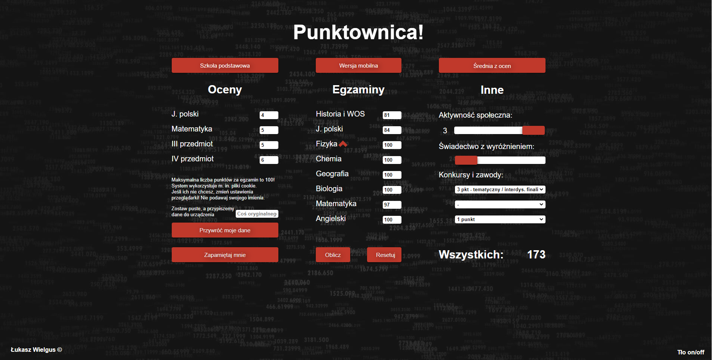
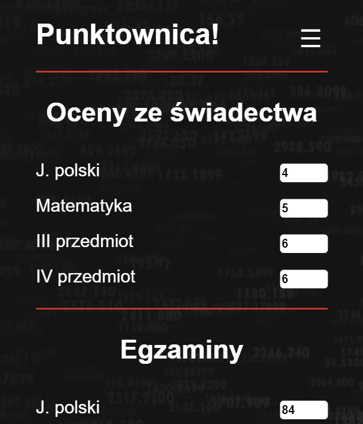

# Punktownica
### A score calculator with a database for students recruiting to high school used by over 20k users in 2019.

## Notice
If you are a recruiter or anyone really, please don't look here.
This was kinda my first project and I now know that this code is ugly.
Everyone starts somewhere and that's where I made the first steps.

**This repository is for archival purposes only.**

### Functionality
On top of standard score calculator features Punktownica remembers you, and automatically restores your data. You can also provide a username to save your data to SQL database and retrieve them on other devices later.

## Made with passion and
HTML, CSS, JavaScript, PHP, MySQL

